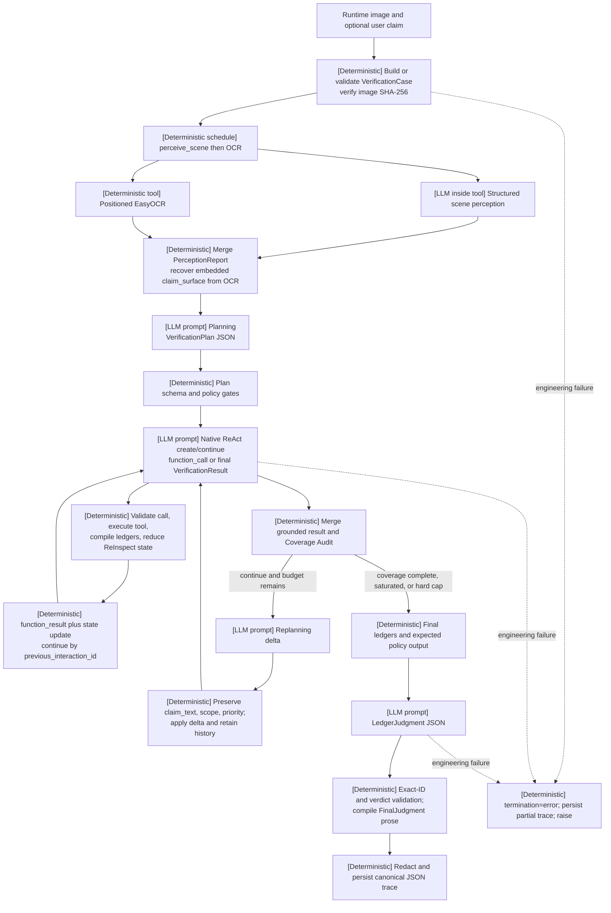

# Agent Prompt and Runtime Guide

This guide describes the active runtime in the current codebase. It uses two labels throughout:

- **[LLM prompt]**: a model call whose output can propose a plan, action, extraction, or decision.
- **[Deterministic code]**: local validation, execution, reduction, gating, or serialization with no model discretion.

A tool can cross both boundaries: the agent chooses the tool through an LLM call, while the tool may make a separate internal LLM call and then pass its result through deterministic validation. The active production path requires Gemini Interactions for Gemini agent and vision calls; it does not silently fall back to another protocol, provider, model, or heuristic output.

## Overall Flow



## Stage I/O

| Stage | Boundary | Input | Output | Principal gate |
| --- | --- | --- | --- | --- |
| Case | **[Deterministic code]** | Image path, optional `VerificationCase` or `user_claim` | Strict `VerificationCase` | Claim-mode contract, normalized region, ISO time, image SHA-256 equality |
| Perception | **[Deterministic schedule]**, with an **[LLM prompt inside `perceive_scene`]** and deterministic OCR | Verified image | `PerceptionReport` | Both required tools succeed; scene/entities are nonempty; boxes and OCR regions normalize |
| Planning | **[LLM prompt]** | Compact case plus perception context | `VerificationPlan` | 1-4 questions, unique IDs, P1 present, declarative `claim_text`, legal scopes/tools/queries |
| Verification action | **[LLM prompt]** | Plan, compact perception, retained evidence, pending ReInspect state | Native `function_call` item(s), or `VerificationResult` JSON | Function schema, explicit `question_id`, duplicate/budget/access/coverage/ReInspect gates |
| Tool observation | **[Deterministic code]**, optionally with a **[tool-internal LLM prompt]** | Validated call plus injected image/immutable claim goal | JSON object with `status=success|error` | Strict tool-result contract; source-policy filtering; runtime metrics removed into metadata |
| ReInspect reduction | **[Deterministic code]** | One recorded observation, old/new ledgers, plan, perception | `ObservationAssessment`, `BeliefDelta`, visual questions/observations, stop assessment | Stable IDs, evidence/discovery provenance, exact pending-spec matching, two-failure exhaustion |
| Coverage Audit | **[Deterministic code]** | Full retained steps, merged result, ledgers, investigation state | `CoverageAudit` | P1 resolution, one P2 attempt, pending visuals, information gain, iteration bounds |
| Replanning | **[LLM prompt]** then **[deterministic apply]** | Only unresolved/unattempted/ReInspect-blocked gaps | `PlanRevision`, then revised `VerificationPlan` | Exact update-ID set; immutable claim text/scope/priority; existing tools; query policy |
| Judgment | **[LLM prompt]** then **[deterministic compile]** | Decisive claim ledger, eligible non-neutral evidence, expected policy values | `LedgerJudgment`, then `FinalJudgment` | Exact claim/evidence IDs, ledger-consistent decisions, deterministic verdict/reasons, `reinspect-v1` |
| Persistence | **[Deterministic code]** | Success or partial error result | Canonical JSON trace | Credential and signed-URL redaction; HTML remains an on-demand derived view |

## Case and Perception

**[Deterministic code]** `build_verification_case()` resolves the path, hashes the image, selects `external_claim` when a nonempty user claim exists and otherwise `embedded_claim`, and fixes `created_at`. A supplied case is Pydantic-strict (`extra="forbid"`) and its hash is rechecked against the actual file. Hidden benchmark labels do not belong in this object. The active judgment validator is fixed to `reinspect-v1`; the case field is descriptive versioning, not a runtime policy selector.

**[Deterministic schedule]** Perception always calls `perceive_scene` and then `ocr_with_position`; the policy model does not choose this sequence. `perceive_scene` is nevertheless an **[LLM prompt inside a tool]**: a Gemini vision structured-output call inventories at most eight visible entities, normalized boxes, literal scene description, and image type. OCR is **[deterministic tool code]** using EasyOCR, including optional regional crops and normalized coordinates. The orchestrator merges and deduplicates the two results. For `embedded_claim`, concatenated OCR text becomes `claim_surface` (up to 4,000 characters) before Planning.

Perception fails hard if either required tool is unavailable or errors, if its result violates the tool contract, or if scene perception returns neither a scene description nor entities. It is deterministic in orchestration and merge behavior, not model-free.

## Planning

**[LLM prompt]** Planning is a no-tool Interactions structured-output call using `planning.SYSTEM_PROMPT`, a runtime-date prefix, `VerificationPlan` JSON Schema, `temperature=0`, and `thinking_level=minimal`. The image is not reattached; `ContextRenderer.render_for_planning()` supplies claim mode, trusted external claim or OCR-recovered claim surface, scene, image type, visible entities, and visible text.

The model separates each retrieval `question` from immutable declarative `claim_text`. It assigns `claim_scope` (`external_fact`, `image_authenticity`, `image_provenance`, or `visible_content`) and priority. **[Deterministic code]** validates unique nonempty IDs, at least one P1, nonempty claim text, registered suggested tools, and queries that do not seek a ready-made fact-check verdict. For external claims, authenticity/provenance cannot become decisive unless asserted by the user claim. Each question later compiles to `claim-<question_id>`; P1/P2/P3 map to decisive/supporting/contextual.

If schema or semantic validation rejects an output, the same stored interaction is continued with a correction context such as `Output rejected: ... Return a corrected JSON object.` Planning allows its configured bounded correction turn and then raises; there is no heuristic plan.

## Gemini Interactions and Native ReAct

### Create and continue

Tool-bearing Gemini stages use `StageRunner._run_native_interactions()`:

1. **[Deterministic code]** Build native function schemas from the active verification registry. Remove model-facing `image_input`, add required enumerated `question_id`, require `additionalProperties=false`, and attach the `VerificationResult` response schema.
2. **[LLM prompt]** Create the first interaction with verification system instructions, compact context, tools, `store=true`, no `previous_interaction_id`, and minimal thinking.
3. **[Deterministic code]** Require an interaction ID and a coherent status: calls imply `requires_action`; `requires_action` must include calls; terminal text must be `completed`.
4. **[Deterministic code]** Execute every independent function call returned in a turn, preserving response order and charging model tokens only to the first `StageStep` from that response.
5. **[LLM prompt]** Continue with the prior response's `interaction_id` as `previous_interaction_id` and an input array made only of `function_result` steps. Tool schemas remain available until the forced final-output call.

No prompt-tag translation is used on this path. The legacy `<tool_call>` parser exists for non-native backends, but Gemini with tools must use native calls. No-tool Planning, Replanning, and Judgment use the same create/continue chain with JSON-schema output and correction text instead of functions.

### `function_call` to `function_result`

For each model `function_call`, **[deterministic code]** requires a call ID, known tool, recursively schema-valid arguments, explicit valid `question_id`, a nonduplicate target, available per-tool budget, permitted search query, and, when present, an exact pending ReInspect specification. The runner stores the control ID as private `__question_id` and the immutable claim as `__claim_text`; neither is forwarded as an arbitrary tool argument. ReAct tool order is model-chosen; before the first accepted verification output, deterministic validation requires every unresolved P1/P2 question to have a real attempt. Later iterations are driven by the outer coverage audit and replanning delta. For retrieval tools, `goal` is overwritten with immutable `claim_text`.

A valid call executes locally. Exceptions and contract violations become typed error observations during verification, not successful evidence. The returned native item is:

```json
{
  "type": "function_result",
  "name": "tool_name",
  "call_id": "provider-call-id",
  "result": [{"type": "text", "text": "{...compact observation...}"}],
  "is_error": true
}
```

`is_error` is present only for an error. The compact text includes `function_call_id`, `question_id`, tool result, deterministic `investigation_state_update`, and `agent_control_state` (attempt counts, untouched P1/P2 IDs, remaining tool budgets, pending visual specs, and next-action guidance). If compacting must truncate, it retains call/question provenance and control state.

Final model text is accepted only after at least one successful tool call, required P1/P2 attempts, grounded evidence checks, and no pending required ReInspect. Rejected output continues the same interaction with a correction context. At the native round cap, **[LLM prompt]** a final continuation sends no tools and explicitly requests JSON; another requested function or invalid output causes stage failure.

## Deterministic ReInspect State Reduction

ReInspect is **[deterministic code]**, not a separate prompted agent stage. After every real call or protocol-error observation, the callback rebuilds a `VerificationResult` from all steps, recompiles ledgers, and calls `InvestigationReducer.reduce(old_ledgers, new_ledgers, step, plan, perception)`.

The reducer emits stable hash-derived records:

- `ObservationAssessment`: success/error, kind, linked claim/question/call, new evidence/discovery IDs, source families, stance/directness, novelty, risks, and a bounded summary.
- `BeliefDelta`: `support`, `refute`, `split`, `create`, `unknown`, or `zero`, comparing old and newly compiled claim status.
- `VisualQuestion`: exactly one source evidence or discovery ID, normalized target box, expected property, allowed visual tools, and state.
- `RegionObservation` and `StoppingAssessment`: the actual revisit result and remaining high-value work.

For non-`external_fact` claims, a usable reverse-image discovery can create a full-image `compare_with_reference` question; direct web evidence tied to a visually stated claim can create a regional OCR/crop question. Target boxes are selected deterministically from matching OCR/entity regions, then fall back to the full image. This current production behavior is runtime-suggested, not evidence that a learned policy proposed the visual check.

The next call must copy `visual_question_id`, source ID, expected property, exact box (except full-reference comparison), allowed tool, and the discovered reference URL. A successful real visual call resolves it; failures increment a counter and exhaust it after two attempts. Pending questions reopen linked non-external claims and block completion; exhausted questions retain a typed unreadable-region distinction. External factual claims are never held hostage to an image comparison and still require direct web evidence.

## Deterministic Coverage Audit

After each verification iteration, **[deterministic code]** derives evidence and anomalies from successful steps, canonicalizes any model-proposed evidence, recompiles all ledgers, gates pending visuals, and runs `_audit_plan_coverage()` over the entire retained trajectory.

Per question, the audit counts real calls and grounded answer-bearing evidence. A question is `resolved` only when its ledger claim is `supported` or `refuted`; a trusted domain, snippet, successful but irrelevant call, or model assertion is insufficient. P1 remains unresolved until decisive; each unresolved P2 must receive at least one real attempt. Information gain is set membership growth in evidence IDs, canonical discoveries/claim statuses, or source families, not a model score.

Stop states are deterministic:

- `coverage_complete`: all decisive claims resolve, every P2 was attempted, and no visual revisit remains.
- `information_saturated`: after the minimum iteration count, the configured consecutive low-gain patience is reached, with no pending visual or unattempted P2.
- `hard_budget_exhausted`: the maximum verification iteration is reached without either earlier stop.
- `continue`: otherwise, causing Replanning when another iteration is available.

Saturation or hard exhaustion converts unresolved P1 question resolutions to `exhausted` and permits typed `unverifiable`; it does not manufacture claim evidence. Verification still raises if every tool failed, no valid stopping state was reached, or any required P1/P2 was never attempted.

## Replanning

**[LLM prompt]** Replanning receives only compact unresolved P1 gaps, unattempted P2s, pending ReInspect specs, prior queries, relevant retained evidence, scene/intent, and the active tool list. It returns a `PlanRevision` delta, not a replacement plan.

**[Deterministic code]** requires exactly one update for every and only unresolved, unattempted, or ReInspect-blocked ID. IDs must already exist; resolved/exhausted questions cannot be rewritten; `claim_text`, `claim_scope`, and priority must be byte-for-byte preserved; tools and queries must remain legal. Applying the delta increments `revision`, records a reason, and replaces only matching questions. All prior steps, evidence, ledgers, investigation state, audits, and plan versions remain retained.

## Ledger and Judgment

`compile_runtime_ledgers()` is **[deterministic code]** and rebuilds five separate collections: claims, sources, evidence, discoveries, and failures. Search/reverse-image rows are discoveries until a fetched page yields a selected exact passage. Web evidence requires the immutable claim as extraction goal, `evidence_eligible=true`, no injection flags, directness, a canonical matching URL, exact text and offsets, artifact SHA-256, ISO retrieval time, valid stance/relevance, a successful immutable call ID, and matching source record. Visual observations can decide only compatible visual scopes; otherwise their stance is forced neutral.

Claim status follows deterministic source policy. Moderate/strong image-region evidence can decide a non-external visual claim. Web evidence is decisive with one eligible official source, or at least two independent eligible non-UGC source components after grouping common source family, artifact hash, and dependencies. Both decisive directions yield `conflicted`; one yields `supported` or `refuted`; weaker evidence leaves the claim open.

Before Judgment, **[deterministic code]** computes the expected verdict (`fake` if any decisive claim is refuted; `real` if all decisive claims are supported; otherwise `unverifiable`), exact claim decisions/evidence IDs, and typed insufficiency reasons. **[LLM prompt]** Judgment sees only decisive ledger rows and eligible non-neutral evidence plus those policy values, and returns `LedgerJudgment`.

The validator requires exactly one decision per decisive claim, exact ownership and stance of every evidence ID, exact selected-ID equality, `policy_rule_id=reinspect-v1`, and the deterministic verdict/reason set. Finally, **[deterministic code]** compiles `FinalJudgment.reasoning_chain`, key evidence, and assessment from ledger text; free-form model prose cannot add facts. Confidence is the remaining model-authored scalar inside `[0,1]`.

## Tool-Internal Prompts

These prompts are independent inference calls inside tools, not extra ReAct decisions:

| Tool/path | Internal boundary | Prompt purpose |
| --- | --- | --- |
| `perceive_scene` | **[LLM prompt]** | Literal entities, normalized boxes, scene, image type |
| `crop_and_inspect` | **[LLM prompt]** | Answer a focus question over a deterministic crop |
| `count_objects` | **[LLM prompt]** | Schema-constrained visible count, confidence, details, locations |
| `check_consistency` | **[LLM prompt]** | Conservative visual/physical consistency analysis |
| `analyze_visual_anomalies` | **[LLM prompt]** | Targeted or broad structured forensic anomaly scan |
| `compare_with_reference` | **[LLM prompt]** | Structured comparison of downloaded reference and query image |
| `reverse_image_search` | **[mixed]** | Provider visual search plus an LLM-generated semantic image query |
| `crop_and_search` | **[mixed]** | Deterministic crop, LLM query generation, then search/browse |
| `text_search` / `visit` browse enrichment | **[mixed]** | Provider search/fetch plus LLM selection of one immutable candidate passage and stance |
| `ocr_with_position`, `current_time` | **[deterministic code/tool]** | EasyOCR regional text or system-clock observation |

Gemini tool-internal calls use Interactions structured output, minimal thinking, and their own schemas. Browse input explicitly brackets the immutable root goal and untrusted webpage text; deterministic code detects prompt-injection patterns and refuses injection-flagged or indirect passages as evidence. Tool-internal calls report private runtime metrics that the runner removes from public tool JSON and adds to step/state call and token totals.

## Dynamic and Correction Contexts

Static prompts live in `src/orchestrator/stages/*.py` and prompt-bearing tool modules. Dynamic context is assembled by **[deterministic code]**:

- Every stage system instruction is prefixed with the runtime date and timezone.
- Planning context is a compact case/perception projection.
- Verification context contains compact perception and the current plan; later iterations append pending ReInspect specs and retained judgment-style evidence.
- Every function result appends deterministic investigation and budget state.
- Replanning includes only current gaps and relevant retained evidence.
- Judgment includes only machine-verifiable ledger IDs and deterministic policy output.

Corrections also come from **[deterministic code]** and are then consumed by an **[LLM prompt]** continuation: missing/invalid JSON, semantic output rejection, invalid tool name/arguments/question ID, duplicate target, exhausted budget, forbidden query, unfair question resampling, or mismatched ReInspect specification. They stay on the same `previous_interaction_id` chain. Tool/page content is untrusted data and cannot alter root claims, schemas, tool policy, or verdict criteria.

## Schemas and Gates

Pydantic `StrictModel` rejects extra fields for runtime records. Interactions response schemas are normalized by inlining local references, removing unsupported annotations, requiring every object property, and setting `additionalProperties=false`; required paths are also checked for vision output. Native function arguments receive recursive local type/required/enum/item validation before execution.

The main gates are cumulative:

- Startup: required tools and credentials/providers exist; Gemini paths use Interactions; all active thinking levels equal `minimal`.
- Case/perception: strict claim contract, hash equality, normalized geometry, required successful observations.
- Plan/replan: bounded structure, immutable claims/scopes/priorities, active tool registry, source-query policy.
- Action: valid interaction envelope/call ID/schema/question, duplicate and budget limits, source-access boundary, exact ReInspect binding.
- Observation/evidence: tool JSON status contract, successful call provenance, exact excerpts, source/artifact/time/span/directness/injection checks, scope compatibility.
- Output/stop/judgment: successful tool work, required attempts, no pending visual, deterministic audit stop, exact ledger IDs and verdict policy.

## Failure Boundaries

Recoverable verification observations include a tool exception converted to `status=error`, malformed tool output converted to a contract error result, invalid model function arguments, duplicate/budget/query/ReInspect violations, access-limited pages, and no-result branches. They are returned with `is_error=true`, reduced into failure state, and may prompt another policy action. They never become evidence.

Hard engineering failures raise and skip Judgment: startup/configuration failure; case hash mismatch; required Perception failure; Gemini transport retry exhaustion; non-retryable HTTP error; invalid success JSON/envelope/status; missing interaction or call IDs; protocol-incoherent `requires_action`; invalid Planning/Replanning/Judgment after bounded correction; verification with no successful tool; unaccepted forced output; timeout; no deterministic stopping state; or a never-attempted required question. Only HTTP `429/500/502/503/504` and transport errors retry the identical Interactions request with delay/jitter. Malformed successful responses are not retried by changing protocol or model.

`unverifiable` is a successful factual outcome only after valid tool work and `information_saturated` or `hard_budget_exhausted` (or unresolved evidence at a valid stop), with exact reasons such as conflict, single-source dependency, access limitation, unreadable region, absent decisive evidence, saturation, or budget exhaustion. It is never an alias for an engineering error.

## Trace Persistence

`VerificationState` retains case, perception, current plan and `plan_history`, merged verification, all `coverage_audits`, ledgers, full `InvestigationState`, final judgment, every `StageStep`, tool health, timings, errors, termination, call totals, and prompt/completion/thought tokens. Native step metadata includes interaction IDs/status, `previous_interaction_id`, call IDs/indexes, verification iteration, cache/tool success, durations, observation updates, and tool-internal metrics. The runtime rejects any nonzero thought-token count on the active minimal-thinking Gemini path.

`VerificationWorkflow` writes canonical JSON by default to `IFV_DATA_ROOT/runs/traces` or `outputs/traces`, on both success and caught failure when state exists. `sanitize_for_persistence()` redacts credential-named fields and authentication query parameters, including within serialized JSON strings. HTML is not canonical and is produced only on demand by `src.render_trace_html`/`src.trace_viewer`. The optional disk tool cache is separate, off by default, and bounded by TTL and namespace.

## Future Teacher/Student Action Spans and Loss Masks

This is a **future training handoff, not implemented by the current runtime**. Teacher and Student should receive identical image/runtime input, tool schemas, real observations, and budgets; neither sees evaluation gold. The existing canonical trace is a strong provenance source, but it does not yet export tokenizer-aligned policy spans or masks.

Add a derived, versioned trajectory exporter without weakening runtime gates. Each step should reference the immutable trace and record at least `episode_id`, `step_id`, `runtime_observation_ref`, `policy_input_token_ids`, `policy_action_token_ids`, `action_json`, `tool_result_ref`, `action_valid`, and `terminated`; episode metadata should add final answer, calls, cost, wall time, and post-run evaluator result. Preserve provider call IDs and interaction-chain IDs so spans remain auditable.

The action/loss mask should be `1` only for policy-generated reasoning (when deliberately retained for training), native `function_call` arguments/actions, and final answer tokens. Mask `0` for system/developer text, runtime date, user/case input, image placeholders/tokens supplied as context, schemas, prior model text used only as context, `function_result` and other environment observations, deterministic reducer/control/audit/ledger content, correction/schema-error text, padding, and all evaluator-private gold. For fatal trajectories, define a versioned cutoff and mask tokens after the fatal boundary while retaining valid pre-failure actions for analysis.

Current visual questions are `proposal_origin=runtime` because `InvestigationReducer` creates them deterministically. A future policy action such as `propose_visual_check` must carry a real prior evidence/discovery ID, question, normalized box, expected property, and allowed visual tool; deterministic code should validate and instantiate it. Export `proposal_origin=policy|runtime` and count only policy-origin proposals toward learned Evidence-to-Vision metrics. Do not fabricate a single canonical chain of thought or train on tool results as though the policy authored them.

## Code Map

- `src/orchestrator/pipeline.py`: stage order, iteration loop, gates, audit, replanning, deterministic evidence derivation, Judgment compilation.
- `src/orchestrator/stage_runner.py`: native create/continue ReAct, schemas, function results, correction contexts, execution and accounting.
- `src/orchestrator/investigation_state.py`: deterministic ReInspect reducer and visual-question state machine.
- `src/orchestrator/ledger.py`: case hashing, provenance ledgers, claim status and insufficiency policy.
- `src/orchestrator/state.py`: strict schemas and canonical aggregate trace state.
- `src/orchestrator/context.py` and `src/orchestrator/stages/`: dynamic context renderers and stage prompts.
- `src/integrations/gemini/interactions.py`: Interactions REST envelope, create payload, extraction, retry and response validation.
- `src/integrations/browse/jina_reader.py` and `src/tools/`: tool-internal prompts and provider/tool contracts.
- `src/workflow.py`, `src/redaction.py`, `src/storage.py`: trace persistence, redaction, and locations.
