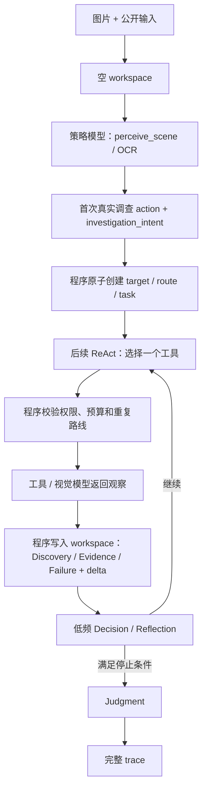

# Agent 结构

IFV 不是单模型聊天。程序管理状态、工具权限和停止条件；策略模型决定调查动作；视觉模型和工具返回可审计的观察。

## 1. 四个组件

| 组件 | 负责 | 不负责 |
| --- | --- | --- |
| 主策略 LLM（`self.llm`） | 选择 scene/OCR/调查工具、ReAct、低频 Decision/Reflection、Judgment | 直接改状态、编造证据、读取 gold |
| 视觉 VLM / 视觉工具 | 场景感知、OCR、视觉复核、参考图比较 | 最终 `real/fake` 判定 |
| Orchestrator | workspace、预算、工具白名单、结果归并、终止检查、trace | 用规则直接猜标签 |
| 外部工具 | 搜索、网页提取、反向搜图、OCR、裁剪、视觉检查 | 直接修改 Agent 状态或下最终结论 |

## 2. 运行流程



每轮只执行一个受限动作。工具结果先由程序归并，再交给策略模型；模型不能依赖未写入
workspace 的隐藏对话。

## 3. workspace 中的核心对象

| 对象 | 含义 |
| --- | --- |
| `ImageClaim` | 图片希望观众相信的现实事实 |
| `SearchHypothesis` | 验证该事实的下一步路线 |
| `Discovery` | 搜索标题、摘要、相似图等候选线索 |
| `Evidence` | 成功工具调用得到、可追溯且能支持或反驳 Claim 的材料 |
| `Failure` | 超时、不可读、OCR 失败或路线耗尽等失败记录 |
| `verdict_basis` | 最终判断引用的 Claim、Evidence 和缺口 |

搜索摘要或“找到同图”本身只是 Discovery，不自动成为 Evidence。

## 4. 两条模型 API 通道

```text
原图
 └─ 视觉通道：`perceive_scene`、OCR、裁剪/视觉复核、参考图比较

结构化观察 + 搜索 Evidence + reducer delta
 └─ 主策略 LLM：统一 ReAct → 低频 Decision / Reflection → Judgment
```

| 模式 | 主策略 LLM | 视觉通道 |
| --- | --- | --- |
| `unified-react-v1` | 不直接看原图；先选择视觉工具，再依据结构化观察选择后续工具 | 处理原图、裁剪图、参考图，并回传可审计观察 |
| 旧 v4 兼容模式 | 保留旧 Planning / Replan 路径，仅用于回放与旧产物兼容 | 与历史行为一致 |

trace 只保存图片引用和 hash，不保存 base64 原图。

## 5. 运行时边界

Agent 只能看到公开输入：`case_id`、图片路径/资产和 hash。正确标签、构造信息、人工答案
及其他 private gold 只在 trace 完成后用于 judge、分桶和训练数据筛选。

训练集和测试集严格隔离：测试集不进入 rollout、SFT 或 RL。`unified-react-v1` 的 reasoning
SFT、action-only 和 RL candidate 也分别列清单，不能和旧 v4 manifest 混用。

## 6. 离线轨迹流程

```text
训练集 → Gemini rollout → 工程重试 → SFT judge → 分桶
       → accepted release / 质量 reroll → SFT 或 RL 数据
```

- 工程错误自动排队重跑；重试耗尽后保留为 `unresolved engineering`。
- 通过轨迹区分 `early_correct_judgment` 和 `final_only_judgment`。
- 所有原始轨迹保留；分桶只建立索引，不删除数据。

## 7. 代码入口

- Agent 与工具：`src/orchestrator/`、`src/tools/`
- 教师 rollout：`scripts/trajectory/run_teacher_rollout_autopilot.py`
- SFT 审计：`python -m src.eval.score_sft_eligibility`
- accepted release：`scripts/trajectory/stage_accepted_teacher_release.py`
- SFT 包：`scripts/trajectory/build_sft_training_package.py`

Prompt 和字段约束见 `agent-prompt-and-runtime-guide.md`；GPU-13 运维见
`operations/gpu13.md`。
