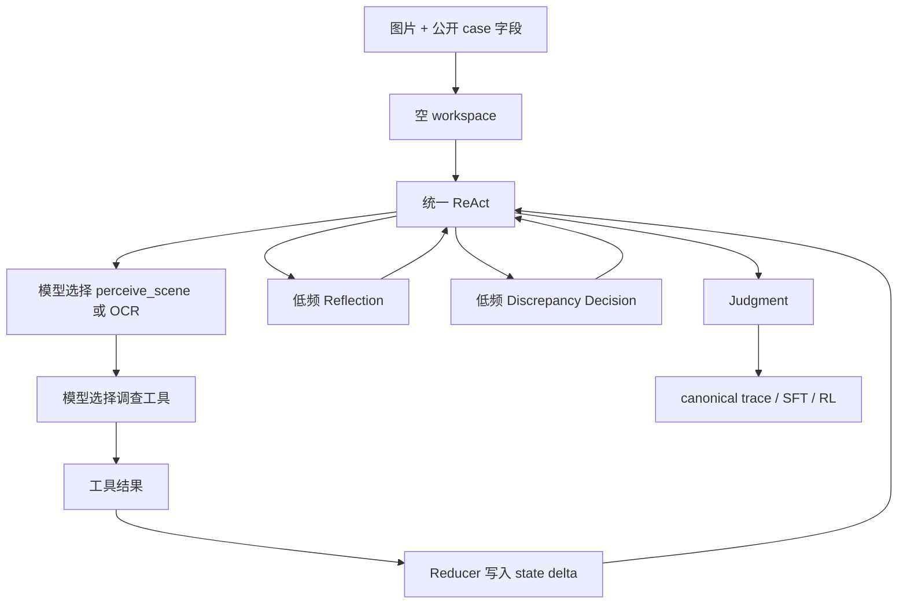

# 当前架构：unified-react-v1

## 1. 结构

## 2. 职责边界

| 部件 | 负责 | 不负责 |
| --- | --- | --- |
| 主策略模型 | thought、下一工具、工具参数 | 直接改 state、读取 gold、制造 Evidence |
| 视觉工具/VLM | 场景、OCR、裁剪、比较等观察 | 最终 verdict |
| Orchestrator/Reducer | 工具白名单、ID、预算、去重、state delta、终止 | 用规则替模型猜标签 |
| 外部检索工具 | 返回搜索/网页/图像观察 | 直接写 Agent state |

## 3. 状态管理

工具返回后，Reducer 写入 `Discovery`、`Evidence`、`Failure` 和不可变 state delta。下一轮只
接收当前紧凑 workspace，不重复携带每一轮的完整累计 workspace。完整原始请求、响应和状态仍
保存在 canonical archive 供审计。

`target_facts` 是当前字段，表示图片要求核查的正向现实事实；它不是 provenance 字段，也不
使用 `image_claims` 作为别名。`perceive_scene` 生成的实体属性、可见关系、场景细节和
像素不确定性会进入受限的视觉 workspace；它们是原图的结构化索引，不替代原图。

## 4. 两种图片 API 模式

- `direct_multimodal`：主策略的每次 ReAct、Reflection、Discrepancy Decision 和 Judgment
  请求都临时带一份压缩原图；当前主流程用于需要策略模型直接观察的实验。
- `separate_vlm`：图片只给视觉工具/VLM，主策略只接收结构化观察、Evidence 和 state delta；
  这是仍保留的独立输入模式。

两种模式共享工具 schema、Reducer 和 trace 格式，不修改成熟工具内部契约。
